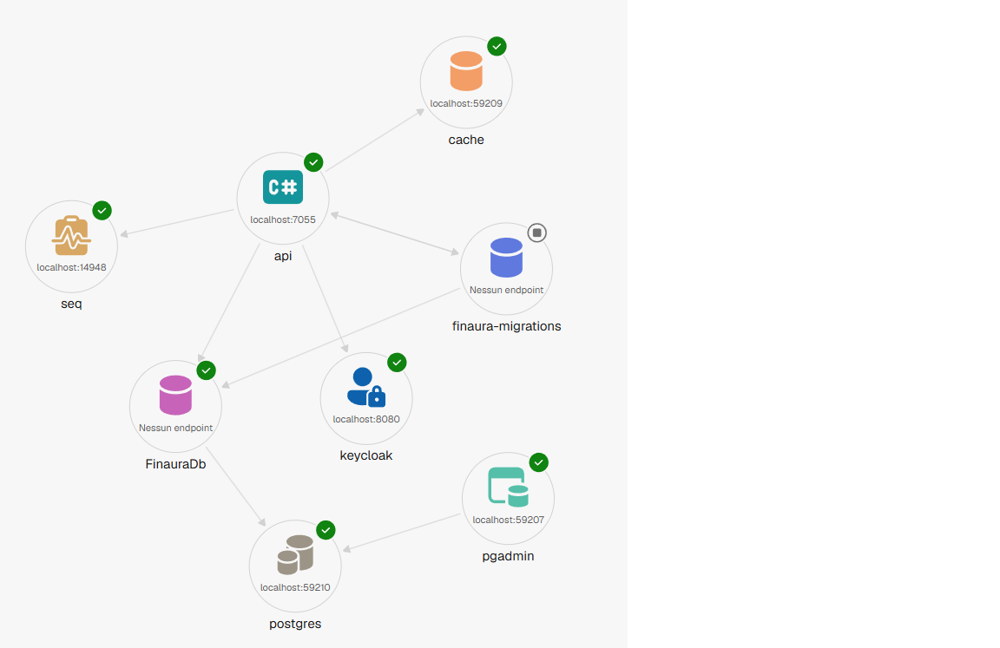

# Finaura

Finaura is a portfolio project built with .NET that simulates a
financial reporting platform.

The platform is designed around a reporting workflow where users manage
reporting entities and reporting periods, import financial positions,
validate data, review errors, approve reports and submit them.

The project is developed as a production-oriented backend application,
with a strong focus on domain modelling, architecture, automated
testing, security, caching, observability and maintainability.

> All companies, financial data, business rules and workflows used in
> this project are fictional.

## Project goals

Finaura aims to demonstrate:

-   Domain-driven modelling with entities and value objects
-   Clean Architecture combined with Vertical Slice Architecture
-   ASP.NET Core Minimal API development
-   Entity Framework Core with PostgreSQL
-   Authentication and policy-based authorization
-   OAuth 2.0 and OpenID Connect integration with Keycloak
-   Distributed and in-memory caching
-   Automated unit, integration and architecture testing
-   Consistent error handling using Problem Details
-   Local development orchestration with .NET Aspire
-   Containerized environments with Docker and Docker Compose
-   Versioned container images published to GitHub Container Registry
-   External service integration
-   Continuous integration and production-oriented development practices

The project is developed incrementally, introducing new technologies and
architectural patterns only when they provide a concrete benefit.

## Current status

The project foundation and the first reporting use cases are currently
implemented.

The application currently includes:

-   Clean Architecture combined with Vertical Slice Architecture
-   `ReportingEntity` and `ReportingPeriod` domain models
-   Strongly typed identifiers and domain value objects, including
    `ReferencePeriod`
-   PostgreSQL persistence with Entity Framework Core
-   Database migrations
-   Reporting entity creation and retrieval
-   Reporting period creation
-   Duplicate reporting entity and reporting period protection
-   Consistent application errors using a Result pattern
-   Problem Details HTTP error responses
-   Global exception handling
-   Keycloak authentication using OAuth 2.0 and OpenID Connect
-   JWT Bearer authentication for the API
-   Role-based and policy-based authorization
-   `Admin`, `Reviewer` and `User` application roles
-   HybridCache with local in-memory caching and Redis distributed
    caching
-   Cache-aside retrieval of reporting entities
-   Local development orchestration with .NET Aspire
-   PostgreSQL, Redis and Keycloak resources managed through Aspire
-   Automated Entity Framework Core database migrations
-   OpenAPI documentation
-   Scalar API documentation
-   Central Package Management
-   Domain unit tests
-   Application integration tests using Testcontainers and Respawn
-   API integration tests covering endpoints, authentication and
    authorization
-   Architecture tests enforcing project dependency and structural rules
-   Static code analysis with SonarQube Cloud
-   GitHub Actions continuous integration
-   Automated test coverage collection
-   SonarQube Cloud analysis integrated into the CI pipeline
-   SonarQube Quality Gate enforcement in CI
-   Docker Compose environment with PostgreSQL, Redis, Keycloak, database
    migrations and the Finaura API
-   Dedicated container images for the API, database migrations and Keycloak
-   Automated container image publication to GitHub Container Registry
-   Custom Keycloak image with automatic realm bootstrap
-   Structured application logging using `ILogger<T>`
-   OpenTelemetry observability for logs, traces and metrics
-   ASP.NET Core, `HttpClient` and Entity Framework Core tracing
-   Seq integration for structured logs and distributed traces

The import, validation, approval and submission workflows described
below are planned and will be implemented incrementally.

## Core workflow

The following workflow describes the target business process for
Finaura. Some steps are already implemented, while the remaining
capabilities will be introduced incrementally.

The Finaura workflow is based on a `ReportingPeriod`, which represents
the reporting process for a specific reporting entity and reference
period.

### 1. Create a reporting period

The client first creates a new reporting period:

``` http
POST /api/reporting-periods
```

Example request:

``` json
{
  "reportingEntityId": "2fac9769-13e7-4c19-9d57-07117130e9b5",
  "referenceYear": 2026,
  "referenceMonth": 6
}
```

The API creates the reporting period and returns its identifier.

A newly created reporting period always starts in the `Draft` state.

The same reporting period identifier is used for all subsequent
operations.

### 2. Upload the first Excel file

The client uploads an Excel file containing the financial positions:

``` http
POST /api/reporting-periods/{reportingPeriodId}/imports
```

The system will:

-   store the original Excel file;
-   create a new import record;
-   read the rows contained in the file;
-   write the imported financial positions to the database;
-   mark the new import as the current version;
-   move the reporting period to the `Imported` state.

The first uploaded file creates import version `1`.

### 3. Validate the imported data

The client starts the validation process:

``` http
POST /api/reporting-periods/{reportingPeriodId}/validate
```

The system executes the configured validation rules against the
financial positions stored in the database.

If blocking errors are found, the reporting period moves to:

``` text
ValidationFailed
```

If no blocking errors are found, it moves to:

``` text
Validated
```

Warnings can be reported without preventing the reporting period from
becoming valid.

### 4. Upload a corrected version

Before approval, the client can upload a corrected Excel file using the
same reporting period identifier:

``` http
POST /api/reporting-periods/{reportingPeriodId}/imports
```

The new file does not physically overwrite the previous file.

Instead, the system creates a new import version:

``` text
Import version 1 -> Historical
Import version 2 -> Current
```

The previous file remains available for audit and traceability.

Uploading a new version:

-   replaces the active financial positions;
-   invalidates previous validation results;
-   increments the import version;
-   requires a new validation;
-   moves the reporting period back to the `Imported` state.

A new Excel file can be uploaded while the reporting period is in one of
the following states:

``` text
Draft
Imported
ValidationFailed
Validated
```

If a new file is uploaded while the reporting period is already
`Validated`, the successful validation is invalidated and must be
executed again.

### 5. Approve the reporting period

A validated reporting period can be approved:

``` http
POST /api/reporting-periods/{reportingPeriodId}/approve
```

Before approval, the system will verify that:

-   the reporting period is in the `Validated` state;
-   no blocking validation errors exist;
-   the current import version is the same version that was successfully
    validated;
-   the user has permission to approve the report;
-   the user approving the report is not the same user who prepared it.

After approval, the reporting period moves to:

``` text
Approved
```

New Excel uploads are no longer allowed after approval.

### 6. Submit the reporting period

An approved reporting period can be submitted:

``` http
POST /api/reporting-periods/{reportingPeriodId}/submit
```

After submission, the reporting period moves to:

``` text
Submitted
```

A submitted reporting period is considered complete and cannot be
modified.

### Workflow overview

``` text
Create reporting period
          |
          v
        Draft
          |
          | Upload Excel v1
          v
       Imported
          |
          | Validate
          v
   +------------------+
   |                  |
   v                  v
ValidationFailed   Validated
   |                  |
   | Upload Excel v2  | Upload Excel v2
   +------------------+
          |
          v
       Imported
          |
          | Validate again
          v
       Validated
          |
          | Approve
          v
       Approved
          |
          | Submit
          v
       Submitted
```

The same `ReportingPeriod` identifier is used throughout the entire
workflow.

Each new Excel file creates a new import version within the same
reporting period until the report is approved.

## Reporting status

A reporting period can move through the following states:

``` text
Draft
Imported
ValidationFailed
Validated
Approved
Submitted
```

Some example business rules are:

-   A new report starts in the `Draft` state
-   A report cannot be validated before data has been imported
-   A report cannot be approved if blocking validation errors exist
-   A report must be approved before it can be submitted
-   A submitted report cannot be modified
-   The user who prepares a report cannot approve the same report

## Architecture

Finaura is structured as a modular monolith using Clean Architecture
principles combined with Vertical Slice Architecture.

The solution is organized into the following projects:

``` text
src/
├── Finaura.Api
├── Finaura.Application
├── Finaura.Domain
├── Finaura.Infrastructure
├── Finaura.AppHost
└── Finaura.ServiceDefaults

tests/
├── Finaura.Domain.Tests
├── Finaura.Application.Tests
├── Finaura.Architecture.Tests
└── Finaura.Api.Tests
```

Clean Architecture defines the dependency boundaries between the main
application layers, while Vertical Slice Architecture is used inside the
Application layer to organize code around individual use cases.

For example:

``` text
Finaura.Application/
├── Common/
│   ├── CQRS/
│   ├── Caching/
│   └── Persistence/
│
├── ReportingEntities/
│   ├── Create/
│   └── GetById/
│
└── ReportingPeriods/
    └── Create/
```

Each feature contains the application code required to implement a
specific use case rather than being organized globally by technical
responsibility.

Finaura intentionally does not use MediatR. Commands, queries and their
handlers are implemented directly in the Application layer and invoked
explicitly by the API.

Entity Framework Core is also used directly by application handlers
rather than being hidden behind generic repository or unit of work
abstractions.

### Finaura.Domain

The Domain project contains the core business model and business rules.

It includes:

-   Entities
-   Value objects
-   Strongly typed identifiers
-   Domain exceptions
-   Domain business rules
-   Domain events when required by implemented features

The current domain includes concepts such as `ReportingEntity`,
`ReportingPeriod` and `ReferencePeriod`.

The Domain project has no dependency on Entity Framework Core, ASP.NET
Core or infrastructure technologies.

### Finaura.Application

The Application project contains the application use cases and database
persistence logic.

Features are organized as vertical slices. Each slice contains the
commands, queries, handlers and result models required by a specific use
case.

The project also contains:

-   Entity Framework Core
-   `FinauraDbContext`
-   Entity configurations
-   Database migrations
-   Query logic
-   HybridCache integration
-   Cache serialization configuration
-   Transaction management when required
-   Shared application abstractions

Entity Framework Core is used directly inside application handlers.

This avoids unnecessary repository abstractions and allows use cases to
take advantage of LINQ queries, projections, change tracking and
transactions directly.

The `DbContext` is confined to the Application layer and is not accessed
directly by API endpoints.

HybridCache is also used directly by application handlers when caching
provides a concrete benefit, without introducing a generic cache
abstraction that would merely wrap the framework API.

### Finaura.Infrastructure

The Infrastructure project contains implementations for external systems
and technical services outside the core database persistence.

It currently configures Redis as the distributed cache implementation
used by HybridCache.

It may also include:

-   File storage
-   Email services
-   External APIs
-   Authentication provider integrations
-   Background processing
-   Message queues
-   Document generation
-   System clock implementations

Abstractions required by application use cases are defined in
`Finaura.Application`, while their infrastructure-specific
implementations are placed in `Finaura.Infrastructure`.

Database persistence is intentionally not implemented in this project.
Entity Framework Core and `FinauraDbContext` belong to
`Finaura.Application`, where they can be used directly by application
handlers.

### Finaura.Api

The API project is the HTTP entry point of the application.

It includes:

-   ASP.NET Core Minimal API endpoints
-   Request and response contracts
-   Dependency injection composition
-   JWT Bearer authentication
-   Policy-based authorization
-   OpenAPI documentation
-   Scalar API documentation
-   Problem Details error responses
-   Global exception handling

API endpoints remain thin and delegate business operations to handlers
in the Application layer.

External request and response models use transport-friendly primitive
types, while API endpoints map them to the corresponding domain and
application types.

### Finaura.AppHost

The AppHost project uses .NET Aspire to orchestrate the local
development environment.

It currently coordinates:

-   Finaura API
-   PostgreSQL
-   pgAdmin
-   Redis
-   Keycloak
-   Seq
-   Entity Framework Core database migrations

Aspire manages service discovery, connection strings and startup
dependencies between application resources.

Database migrations are automatically applied during application startup
before the API begins handling requests.

### Finaura.ServiceDefaults

The ServiceDefaults project contains shared .NET Aspire service
configuration used by application projects.

It provides common defaults for cross-cutting concerns such as service
discovery, resilience, health checks and telemetry configuration.

OpenTelemetry is configured centrally in this project, including structured
logging, ASP.NET Core tracing, `HttpClient` tracing, Entity Framework Core
database tracing and application/runtime metrics.

## Project dependencies

The core application follows the dependency direction defined by Clean
Architecture:

``` text
Finaura.Api ------------> Finaura.Application
Finaura.Api ------------> Finaura.Infrastructure

Finaura.Infrastructure -> Finaura.Application
Finaura.Application ----> Finaura.Domain
```

The following dependencies are not allowed:

``` text
Finaura.Domain ---------> Finaura.Application
Finaura.Domain ---------> Finaura.Infrastructure
Finaura.Application ----> Finaura.Infrastructure
```

This keeps the Domain independent and ensures that application use cases
do not depend on infrastructure implementations.

`Finaura.AppHost` is responsible for local orchestration and references
the projects and resources required to compose the application.

`Finaura.ServiceDefaults` provides shared Aspire configuration and is
not part of the core Clean Architecture dependency flow.

Architecture tests automatically verify important dependency and
structural rules.

## Persistence approach

Finaura uses Entity Framework Core directly inside the Application layer
and does not introduce generic repository or unit of work abstractions.

Entity Framework Core already provides the main persistence capabilities
required by the application:

-   Change tracking
-   Identity map
-   LINQ query composition
-   Transaction support
-   Unit of work behaviour through `DbContext`
-   Entity collection access through `DbSet<T>`

Application handlers therefore use `FinauraDbContext` directly.

Commands can load and modify domain entities through the `DbContext`,
while queries can use `AsNoTracking()` when change tracking is not
required.

PostgreSQL is used as the relational database, with Entity Framework
Core migrations managing schema evolution.

Integration tests run against real PostgreSQL instances using
Testcontainers rather than mocking Entity Framework Core.

## Caching

Finaura uses `HybridCache` for use cases where cached reads provide a
concrete benefit.

The current implementation applies a cache-aside strategy when
retrieving a reporting entity:

``` text
GET /api/reporting-entities/{id}
              |
              v
         HybridCache
          /       \
         /         \
 L1 Memory       L2 Redis
         \         /
          \       /
          PostgreSQL
```

The cache currently uses:

-   **L1 local memory cache:** 5 minutes
-   **L2 Redis distributed cache:** 30 minutes

The local cache provides fast access within an individual API instance,
while Redis provides a shared cache that can be reused across multiple
application instances.

Application handlers depend on `HybridCache` rather than Redis directly.
Redis is registered by the Infrastructure layer as the distributed cache
implementation.

This keeps the Application layer independent from the specific
distributed cache technology.

Domain value objects used in cached application models are explicitly
serialized so that their invariants and strongly typed representation
can be preserved across cache serialization boundaries.

Cache entries are considered disposable and can always be rebuilt from
PostgreSQL.

Future update operations will invalidate affected cache entries
explicitly rather than relying only on expiration.

## Local development with .NET Aspire

Finaura uses .NET Aspire to compose and run the complete local
development environment.

The AppHost currently starts and coordinates:

``` text
Finaura API
    |
    +---- PostgreSQL
    |        |
    |        +---- FinauraDb
    |        +---- pgAdmin
    |
    +---- Redis
    |
    +---- Keycloak
    |
    +---- Seq
    |
    +---- EF Core migrations
```

The API receives resource connection information through Aspire
references rather than requiring local infrastructure addresses to be
hard-coded in application configuration.

For example, Redis is exposed to the application using the logical
connection string name:

``` text
cache
```

The same logical configuration can be supplied through environment
variables or secrets when running outside Aspire.

The Keycloak instances used by Aspire and Docker Compose have independent
runtime state. When both environments expose Keycloak on `localhost:8080`,
they should not be run at the same time because the shared host port can cause
endpoint conflicts and inconsistent HTTP/HTTPS behaviour.

Database migrations run as part of the Aspire startup orchestration and
complete before the API begins handling requests.

### Aspire dashboard

The Aspire dashboard provides a single view of the resources that
compose the local environment, including their status, endpoints, logs,
traces, metrics and health information.



## Docker and containerized environment

Finaura also provides a Docker Compose environment that can run the
application stack without requiring .NET Aspire.

The Compose environment coordinates:

``` text
PostgreSQL
    |
    +---- Finaura migrations
              |
              v
          Finaura API
              |
              +---- Redis
              |
              +---- Keycloak
```

Database migrations run in a dedicated one-shot container. The API starts
only after the migration container completes successfully.

Keycloak is packaged in a Finaura-specific image that extends the official
Keycloak image. The realm bootstrap configuration is included in the image
and copied into the persistent Keycloak data volume when the container
starts.

Generated Keycloak signing and encryption key material is intentionally not
stored in the repository. Keycloak creates its runtime keys when a fresh
realm is initialized.

The current container images are published to GitHub Container Registry:

``` text
ghcr.io/stebzdev/finaura-api
ghcr.io/stebzdev/finaura-migrations
ghcr.io/stebzdev/finaura-keycloak
```

Each image is published with both a `latest` tag and a commit-specific
`sha-<git-sha>` tag.

The Docker Compose configuration is intended for local development, testing
and reproducible demo environments. Production deployments would require
environment-specific hardening such as external secret management, TLS,
production Keycloak settings and infrastructure-specific persistence.

## Error handling

Expected application failures are represented using a Result pattern
rather than exceptions.

Application errors distinguish categories such as:

-   Validation
-   Not found
-   Conflict

The API translates these errors into consistent Problem Details HTTP
responses.

For example:

``` text
Application Result
       |
       +---- Validation ----> 400 Bad Request
       |
       +---- NotFound ------> 404 Not Found
       |
       +---- Conflict ------> 409 Conflict
```

Domain exceptions represent violations of domain invariants and are
handled centrally by the API.

Unexpected exceptions are converted into generic
`500 Internal Server Error` Problem Details responses without exposing
implementation details.

## Security

Finaura uses Keycloak as its external identity provider.

Authentication is based on OAuth 2.0 / OpenID Connect and JWT Bearer
tokens.

The application currently defines the following roles:

``` text
Admin
Reviewer
User
```

For the containerized environment, the Keycloak realm configuration is
packaged as bootstrap data in the custom Keycloak image. Generated private
keys and provider secrets are not committed to the repository.

Authorization policies are applied directly to API endpoints.

For example, reporting entity creation is restricted to administrators,
while reporting entity retrieval requires an authenticated user without
requiring a specific role.

This separates authentication concerns from application authorization
rules and keeps identity management outside the core application.

## Observability

Finaura uses OpenTelemetry for application observability.

Telemetry is configured centrally in `Finaura.ServiceDefaults` and currently
includes:

-   Structured application logging through `ILogger<T>`
-   ASP.NET Core request tracing
-   `HttpClient` tracing
-   Entity Framework Core / PostgreSQL tracing
-   ASP.NET Core metrics
-   `HttpClient` metrics
-   .NET runtime metrics

Structured message templates are used instead of string interpolation so that
business properties remain independently searchable in observability backends.

For example:

``` csharp
logger.LogWarning(
    "Reporting entity with code {Code} already exists",
    code.Value);
```

The rendered message remains human-readable while `Code` is also exported as a
structured property.

Distributed traces correlate incoming HTTP requests with downstream operations,
including database commands executed by Entity Framework Core against
PostgreSQL.

Database query parameter values are not collected by default because they may
contain sensitive data. They can be enabled explicitly for local Development
diagnostics when required.

### Aspire dashboard

When Finaura runs through .NET Aspire, the Aspire dashboard provides the local
view for structured logs, distributed traces and metrics.

### Seq

Seq is integrated as an additional local OpenTelemetry backend for:

-   Structured logs
-   Distributed traces

Seq is useful for querying structured log properties and correlating application
events with traces. Metrics remain available through the Aspire dashboard.

Finaura keeps the standard `Microsoft.Extensions.Logging` abstractions and does
not require Serilog for the current observability setup.

## API documentation

Finaura exposes OpenAPI metadata for its HTTP API.

Scalar provides an interactive interface for exploring and testing the
available endpoints during development.

API documentation is generated from the application's actual endpoint
definitions rather than maintained as a separate manual API
specification.

## Central Package Management

NuGet package versions are managed centrally using
`Directory.Packages.props`.

Individual project files declare their package dependencies without
repeating package versions, while the solution-level configuration
defines the versions used across the repository.

This keeps dependency versions consistent and makes package upgrades
easier to review and maintain.

## Technology stack

Finaura currently uses:

-   .NET 10
-   ASP.NET Core Minimal APIs
-   Entity Framework Core
-   PostgreSQL
-   HybridCache
-   Redis
-   .NET Aspire
-   Keycloak
-   OAuth 2.0 and OpenID Connect
-   JWT Bearer authentication
-   OpenAPI
-   Scalar
-   xUnit
-   Testcontainers
-   Respawn
-   NetArchTest
-   SonarQube Cloud
-   GitHub Actions
-   Docker
-   Docker Compose
-   GitHub Container Registry
-   OpenTelemetry
-   Seq

Additional technologies may be introduced as the project evolves:

-   Background workers
-   Message queues

Technologies and architectural patterns are introduced only when they
provide a concrete benefit to an implemented feature.

## Planned validation rules

The initial validation workflow may include rules such as:

  Rule                                      Severity
  ----------------------------------------- ----------
  Position identifier is missing            Error
  Position identifier is duplicated         Error
  Currency is not supported                 Error
  Counterparty is missing                   Error
  Exposure amount is negative               Warning
  Exposure exceeds a configured threshold   Warning

Validation results may use the following severities:

``` csharp
public enum ValidationSeverity
{
    Information,
    Warning,
    Error
}
```

A report cannot be approved while validation results contain blocking
errors.

## Testing strategy

Automated testing is a core part of Finaura and is divided into separate
test projects according to responsibility.

### Domain tests

`Finaura.Domain.Tests` contains fast unit tests for domain behaviour and
invariants.

These tests do not access the database or external infrastructure.

Examples include:

-   A new reporting period starts in the `Draft` state
-   Invalid reference periods cannot be created
-   Reporting entity codes cannot be empty
-   Domain objects enforce their own invariants

### Application integration tests

`Finaura.Application.Tests` verifies application use cases and
persistence against a real PostgreSQL database.

The tests use:

-   Testcontainers to create an isolated PostgreSQL instance
-   Entity Framework Core migrations to create the database schema
-   Respawn to reset database state between tests
-   HybridCache test configuration for cached application queries

Entity Framework Core is not mocked.

These tests cover application handlers, database mappings, persistence
rules, database constraints and cache-aside behaviour.

Caching tests also verify that strongly typed domain values survive the
HybridCache serialization boundary correctly.

### API integration tests

`Finaura.Api.Tests` verifies the application through its HTTP boundary.

The tests run the ASP.NET Core application using a test host and cover:

-   HTTP endpoints
-   Request and response contracts
-   Problem Details error responses
-   Authentication
-   Authorization policies
-   Persistence through the complete API flow

Authentication is replaced by a dedicated test authentication scheme,
allowing authorization behaviour to be tested independently from
Keycloak.

PostgreSQL still runs as a real Testcontainers database.

Redis is replaced by an in-memory distributed cache for API integration
tests, keeping the tests focused on Finaura's HTTP behaviour without
requiring an additional external cache container.

### Architecture tests

`Finaura.Architecture.Tests` verifies architectural and structural rules
automatically.

These tests help enforce constraints such as:

-   Allowed project dependencies
-   Domain independence
-   Namespace conventions
-   Type and naming conventions
-   Structural rules

This makes architectural boundaries executable rather than relying only
on documentation and developer discipline.

### Test coverage

Test coverage is collected automatically as part of the CI pipeline and
reported to SonarQube Cloud.

Coverage is used as a diagnostic tool to identify untested behaviour and
unnecessary code rather than as a target metric by itself.

Generated and orchestration-focused code, such as Entity Framework Core
migrations, the Aspire AppHost and ServiceDefaults, is excluded from
coverage metrics. These exclusions keep the metric focused on
application behaviour that provides meaningful value when tested.

## Code quality

Finaura uses SonarQube Cloud for continuous static analysis of
reliability, maintainability and security issues.

A GitHub Actions CI pipeline automatically:

-   restores dependencies;
-   builds the solution in Release configuration;
-   runs the complete automated test suite;
-   collects test coverage;
-   submits static analysis and coverage results to SonarQube Cloud;
-   waits for the SonarQube Quality Gate result;
-   blocks downstream image publication when the Quality Gate fails;
-   builds the API, migrations and Keycloak container images;
-   publishes container images to GitHub Container Registry on pushes to
    `main`.

The solution is built before SonarQube analysis with compiler warnings
treated as errors, ensuring that CI preserves the repository's build
quality rules independently from static analysis.

Static analysis, compiler diagnostics, automated tests, architecture
tests and coverage provide complementary feedback on different aspects
of code quality.

## API endpoints

### Implemented

``` http
POST /api/reporting-entities
GET  /api/reporting-entities/{id}

POST /api/reporting-periods
```

### Planned

``` http
GET  /api/reporting-periods/{id}

POST /api/reporting-periods/{id}/imports
POST /api/reporting-periods/{id}/validate
POST /api/reporting-periods/{id}/approve
POST /api/reporting-periods/{id}/submit
```

The API uses consistent Problem Details responses for application and
domain errors.

Protected endpoints use authentication and policy-based authorization
according to the requirements of each use case.

## Roadmap

### Phase 1 --- Project foundation

-   [x] Create the GitHub repository
-   [x] Create the .NET solution
-   [x] Define the project structure
-   [x] Configure Clean Architecture dependencies
-   [x] Add shared build configuration
-   [x] Add Central Package Management
-   [x] Add architecture tests
-   [x] Add .NET Aspire for local orchestration

### Phase 2 --- Core domain model

-   [x] Model `ReportingEntity`
-   [x] Model `ReportingPeriod`
-   [x] Model `ReportingStatus`
-   [x] Introduce strongly typed identifiers
-   [x] Introduce domain value objects
-   [x] Model `ReferencePeriod`
-   [x] Add domain exceptions
-   [x] Add domain unit tests
-   [ ] Implement reporting status transitions

### Phase 3 --- Persistence

-   [x] Add Entity Framework Core
-   [x] Create `FinauraDbContext`
-   [x] Configure PostgreSQL
-   [x] Add entity configurations
-   [x] Add database migrations
-   [x] Add application integration tests
-   [x] Use Testcontainers for PostgreSQL integration tests
-   [x] Use Respawn for database isolation
-   [ ] Add optimistic concurrency

### Phase 4 --- API, security and caching

-   [x] Create reporting entity endpoint
-   [x] Create reporting entity query endpoint
-   [x] Create reporting period endpoint
-   [x] Add Problem Details error handling
-   [x] Add global exception handling
-   [x] Add OpenAPI documentation
-   [x] Add Scalar API documentation
-   [x] Integrate Keycloak
-   [x] Add JWT Bearer authentication
-   [x] Add role-based and policy-based authorization
-   [x] Add HybridCache
-   [x] Add Redis distributed caching
-   [x] Implement cache-aside reporting entity retrieval
-   [x] Add API integration tests
-   [x] Add authentication and authorization tests
-   [ ] Add reporting period query endpoints

### Phase 5 --- Import and validation

-   [ ] Implement Excel import
-   [ ] Add versioned imports
-   [ ] Store original imported files
-   [ ] Model financial positions
-   [ ] Implement validation rules
-   [ ] Store validation results
-   [ ] Support corrected import versions
-   [ ] Prevent invalid report approvals

### Phase 6 --- Approval and submission

-   [ ] Implement report approval
-   [ ] Implement report submission
-   [ ] Enforce workflow state transitions
-   [ ] Enforce separation of duties
-   [ ] Add workflow authorization policies
-   [ ] Add audit tracking

### Phase 7 --- Production-oriented features

-   [x] Add static code analysis with SonarQube Cloud
-   [x] Add structured logging
-   [x] Add application observability with OpenTelemetry
-   [x] Add Entity Framework Core tracing
-   [x] Integrate Seq for structured logs and distributed traces
-   [ ] Add background processing where required
-   [x] Containerize the Finaura API
-   [x] Add dedicated database migration image
-   [x] Add custom Keycloak image with realm bootstrap
-   [x] Add Docker Compose environment
-   [x] Publish container images to GitHub Container Registry
-   [x] Add GitHub Actions CI
-   [x] Add automated test coverage reporting
-   [x] Integrate SonarQube analysis into CI
-   [x] Enforce the SonarQube Quality Gate in CI
-   [ ] Add additional resilience mechanisms where required
-   [ ] Publish the first release

## Project status

Finaura is actively under development.

The project foundation, core reporting entities, PostgreSQL persistence,
authentication, authorization, distributed caching, observability and the first
API use cases are implemented and covered by automated tests.

The application can be orchestrated locally through either .NET Aspire or
Docker Compose. Container images for the API, database migrations and
Keycloak are built by CI and published to GitHub Container Registry after
the test suite and SonarQube Quality Gate succeed.

The next major development milestone focuses on the import and
validation workflow, starting with versioned Excel imports and financial
position modelling.

## Disclaimer

Finaura is a personal portfolio and educational project.

It is not intended for real financial reporting, regulatory compliance,
investment decisions or production financial operations.
